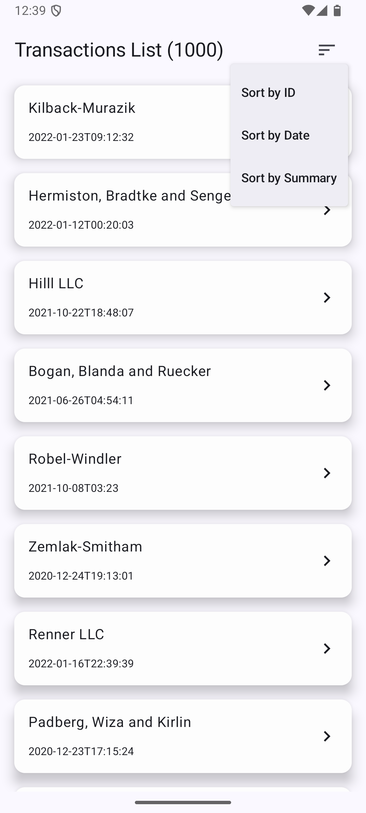
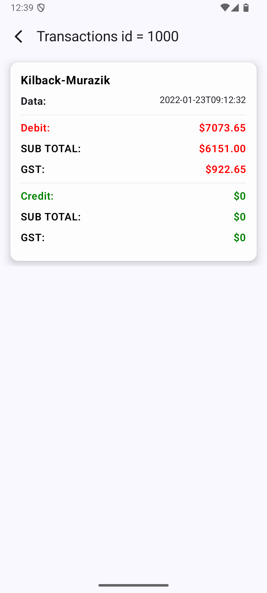
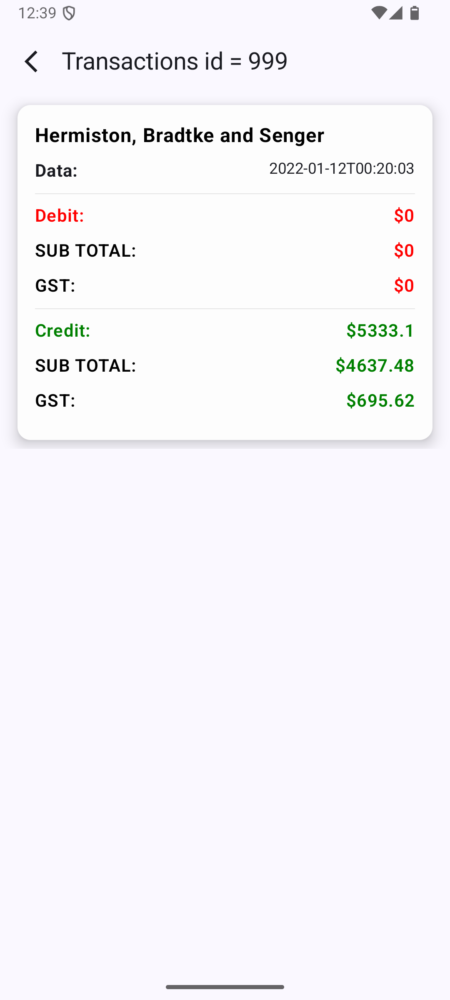

  

## Build and Test

* build apk
```
script/build
```
* run unit tests
```
script/test
```

```shell

> Task :app:testDebugUnitTest
TransactionViewModelTest > fetchTransactions should update transactions state flow on success PASSED
TransactionViewModelTest > sortedList should sort transactions by ID PASSED
TransactionViewModelTest > fetchTransactions should update errorMessage on IOException PASSED
TransactionDetailViewModelTest > fetchTransactions should filter transactions by transactionId PASSED
TransactionDetailViewModelTest > fetchTransactions should update errorMessage on unexpected exception PASSED
TransactionDetailViewModelTest > fetchTransactions should clear errorMessage on success PASSED
TransactionDetailViewModelTest > getTransactionId should return correct transactionId PASSED
TransactionDetailViewModelTest > fetchTransactions should update errorMessage on HttpException PASSED
TransactionDetailViewModelTest > fetchTransactions should update transactions state flow on success PASSED
TransactionDetailViewModelTest > fetchTransactions should update errorMessage on IOException PASSED
OpenJDK 64-Bit Server VM warning: Sharing is only supported for boot loader classes because bootstrap classpath has been appended

> Task :app:testReleaseUnitTest
TransactionViewModelTest > fetchTransactions should update transactions state flow on success PASSED
TransactionViewModelTest > sortedList should sort transactions by ID PASSED
TransactionViewModelTest > fetchTransactions should update errorMessage on IOException PASSED
TransactionDetailViewModelTest > fetchTransactions should filter transactions by transactionId PASSED
TransactionDetailViewModelTest > fetchTransactions should update errorMessage on unexpected exception PASSED
TransactionDetailViewModelTest > fetchTransactions should clear errorMessage on success PASSED
TransactionDetailViewModelTest > getTransactionId should return correct transactionId PASSED
TransactionDetailViewModelTest > fetchTransactions should update errorMessage on HttpException PASSED
TransactionDetailViewModelTest > fetchTransactions should update transactions state flow on success PASSED
TransactionDetailViewModelTest > fetchTransactions should update errorMessage on IOException PASSED

```
## Technologies Used

- Jetpack Compose
- Hilt
- Retrofit 2
- Moshi
- Coroutines
- StateFlow
- Material 3
- Kotlin
- ViewModel

## Summary of Technology Stack:

- UI: Jetpack Compose, Material 3
- Dependency Injection: Hilt, Dagger
- Network Requests: Retrofit 2, Moshi
- Asynchronous Programming: Kotlin Coroutines
- State Management: StateFlow, MutableStateFlow
- Data Storage & Models: ViewModel

> These technologies combine to create a modern, efficient workflow for Android development.

# Android
Create a simple application that will fetch a list of transactions from an api endpoint and display them in a list.  When a user selects a transaction they will be shown a second screen that will display a more detailed view of the transaction data. 

We have given you some code over here to start with. Please clone/fork this repository. 

## Specification
- Consume the following API: https://gist.githubusercontent.com/Josh-Ng/500f2716604dc1e8e2a3c6d31ad01830/raw/4d73acaa7caa1167676445c922835554c5572e82/test-data.json  
- Display data in a sorted list 
- Open a detailed view when user selects a list item 

## Commits
Please commit frequently to communicate your thoughts while working on this assignment.

## What is valued
- Tests 
- Best practice design patterns 
- Clean Code 

## Nice to have (If you have time)
- Calculate how much GST was paid on each transaction.  GST is 15%.  It is up to you to choose the most appropriate place to display GST 
- Color code transaction amounts (credit green, debit red)
- Narration/talkback support 

## Duration 
Try not to spend more than 4 hours on this. You are not necessarily expected to do everything in this assignment because of the short duration. 

## Tech
- Please use Native Android frameworks only (no Flutter sorry) 
- Aside from the above, use whatever libraries you are comfortable with
- If you are unfamiliar with something in the exercise template, leave a note and change it to better suit you.
